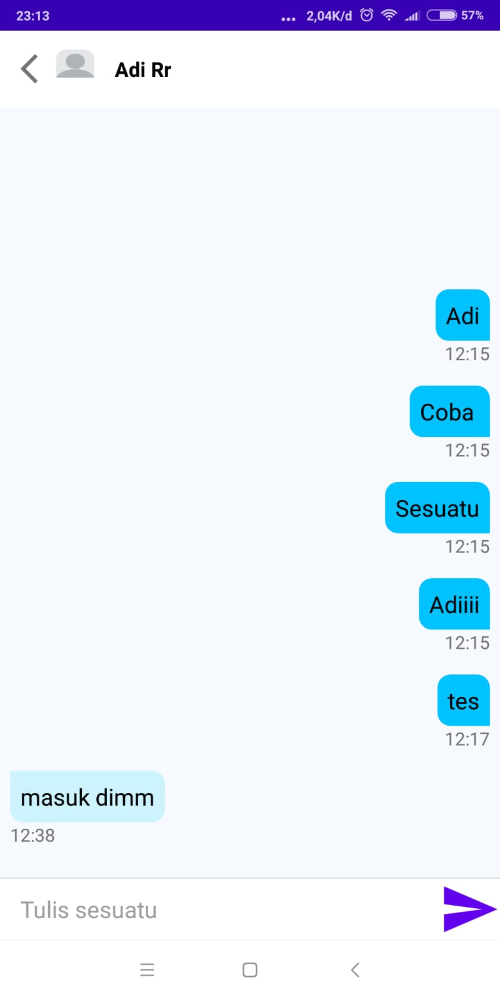
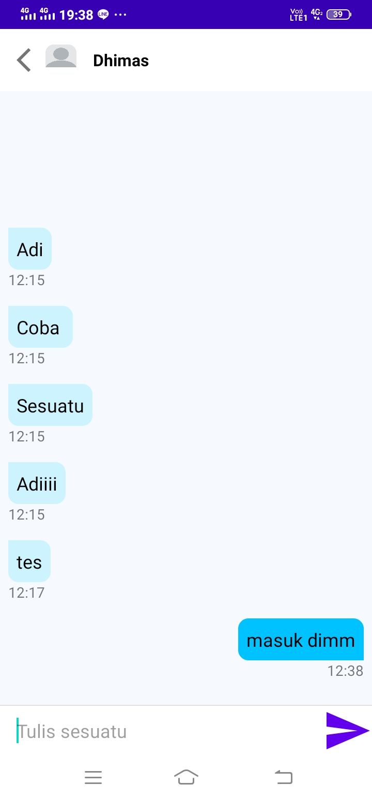
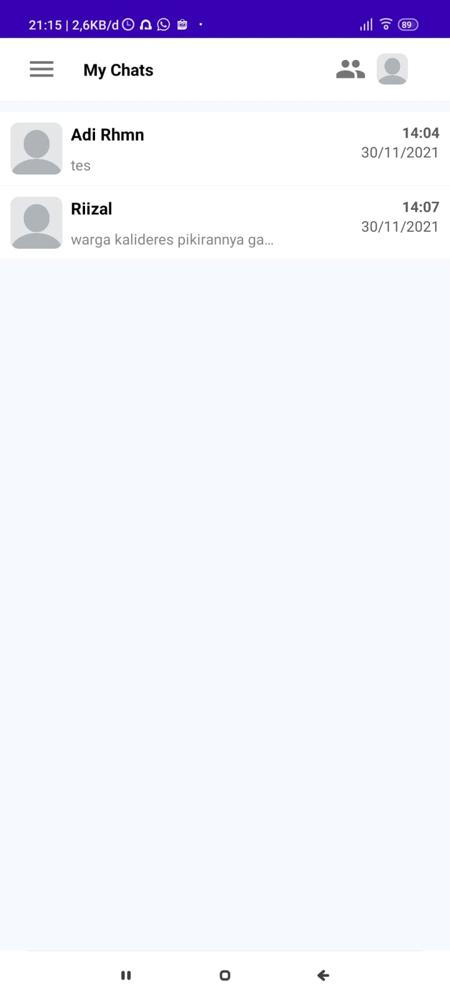

# My Chat App with Firebase Cloud Messaging (FCM)

## Members

1. Adi Rahman (1313618037)
2. Dhimas Amri Pratama (1313618018)
3. Yusriizal Piliyang (1313618022)

## App Features

My Chat App dapat melakukan chatting antara dua orang secara real time.
Ada juga fitur recent chat supaya bisa membuka chat yang sebelumnya secara cepat.
Terakhir ada fitur "Friend list" yang berisi kontak-kontak yang bisa dihubungi.

## Source Code & APK 
- Berikut ini sourcode dari aplikasi MyChat : https://github.com/adirhmn/my-chat-app-with-fcm/tree/main/MyChat%20App
- Berikut ini sourcode backend(server) : https://github.com/adirhmn/my-chat-app-with-fcm/tree/server
- Berikut ini file APK yang dapat diinstall : https://github.com/adirhmn/my-chat-app-with-fcm/tree/main/APK

## Useful Links

Video demontrasi penggunaan My Chat App bisa dilihat disini : https://youtu.be/jxh0O7pda5U

## Screen Shots 

  
  &nbsp &nbsp
  
  &nbsp &nbsp
  

